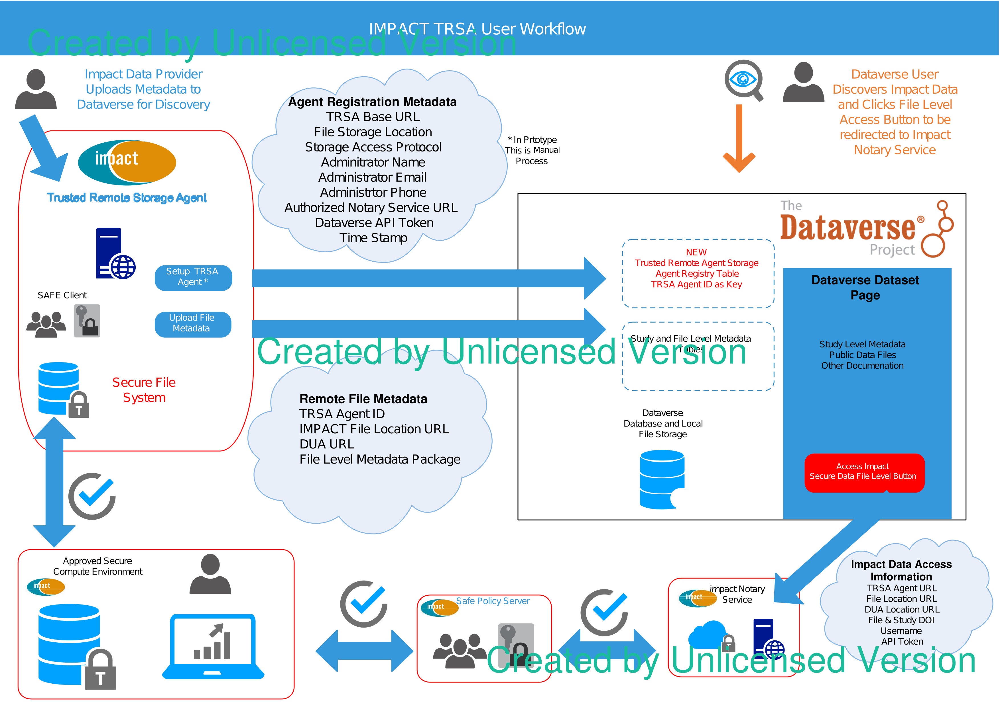

= Web Interface for the Dataverse Trusted Remote Storage Agent
* last updated: 2021-06-03

== Overview

== Testing the Docker image
To stand up a test deployment:
----
	$ docker pull odumunc/trsa-web:2.0

	$ docker run --name trsa-web -p 8080:8080 --restart unless-stopped odumunc/trsa-web:2.0
----
Then use a web browser to visit the container's IP:
----
	$ links http://172.17.0.2:8080/trsa-web-2.0
----

== Building your Docker container
To build your own Docker container:

* Edit `trsa.config` to suit your needs, then `docker build` with your desired name and tag.

== Version 3 and after : how to build a docker image and run its container

=== Major changes

* The official Payara sever-full image (JDK-11 version) is used as the base image; this implies the user is payara, not root.
* The file storage directory was changed to `/opt/payara/trsa/files` from `/trsa/files`.
* The context root no longer has a version-tag segment: `/trsa-web` not `/trsa-web-2.0` .
* Each version has its own dockerfile and its corresponding `trsa.config` file
** for version 3.0, its dockerfile = `v3.dockerfile` and its trsa.config file = `v3.trsa.config`
* 

