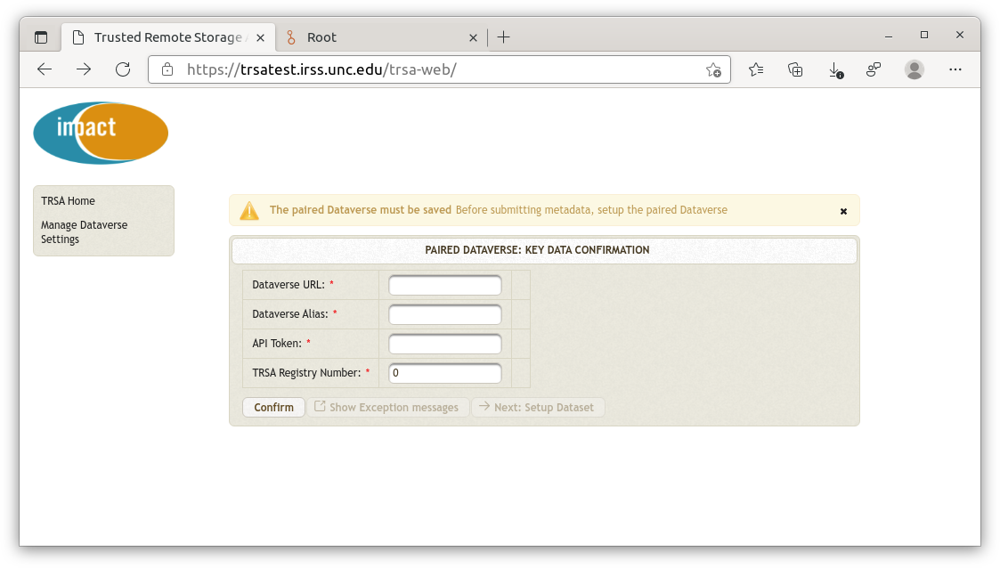

= TRSA-Web: Step-by-Step GUI Guide

:toc:
:toclevels: 3

:figure-caption: Figure 

* last updated: 2022-01-31

== Before you start 

=== Requirements 

* Dataverse

** TRSA-Web Registration
** Dataset
*** Dataset ID
*** Dataset DOI

* TRSA-Web

== GUI Guide

=== How to set up the paired Dataverse and Dataset 

==== Dataverse

When you start to run the TRSA-Web application very first time or if you have not yet set up a paired dataverse with TRSA-Web, the following warning message in orange shows up when you reach its home page.

image::sbsg_image/top-page_2022-01-24.png[TRSA's Home page]

The first thing you have to do is to let TRSA-Web save key information about the paired Dataverse with its web GUI.

. Click the button entitled "Setup the paired Dataverse"

And the following web page shows up.

. Enter key information about the paired Dataverse in each box as the following example shows: 

image::sbsg_image/after_dv_data_entered_2022-01-28.png[Data entry example]

. Click the "Confirm" button to check whether entered data are valid; if successfully confirmed, the message appears above the GUI pane and the "Next: Setup Dataset" button is enabled as shown below:

image::sbsg_image/after_dv_confirmation_2022-01-28.png[After Successful Confirmation]

If failed, the error message appears above the GUI pane and you can check a detailed message by clicking the "Show Exception messages" button.

==== Dataset 
After having clicked the "Next: Setup Dataset" button, the following web page like below appears: 

image::sbsg_image/fill_dataset_data_2022-01-28.png[Incomplete Dataset information]

As you can see the last 3 columns are not valid or empty.  You must enter valid data in these three columns as follows:

. Select the row you want to edit by clicking it
. Click the "Edit" button below the table 

After having clicked the "Edit" button, the following GUI pane pops up: 

image::sbsg_image/edit_dataset_data_gui_2022-01-28.png[GUI Pane for Dataset Information]

Update the data as follows (the figure below shows an example)

. Replace "0" in the box for "DatasetId" with a valid Dataset Id 
. Enter DOI information in the box for "Datasetdoi"
. Enter title data in the box for "Datasettitle"
. Click the Save button

image::sbsg_image/dataset_data_entered_2022-01-28.png[Dataset Information: An Example]

After data for your destination dataset are successfully saved, the table of paired Datasets appears like below:

image::sbsg_image/after_dataset_data_supplied_2022-01-28.png[Table of Paired Dataset]

To return the top menu (home page) of TRSA-Web, click the "TRSA Home" link at the left pane

== How to submit Metadata to a remote Dataset

=== top menu 

=== destination selection 

=== file upload /ingest

=== submission 

=== Manage Dataverse Settings 

