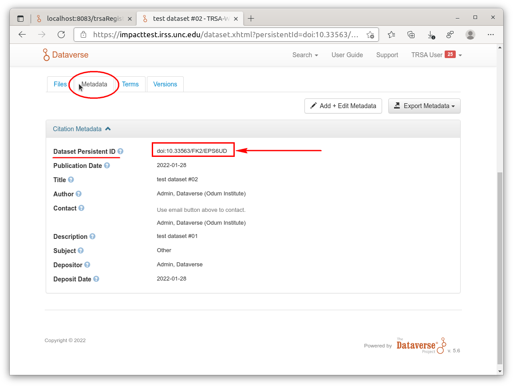
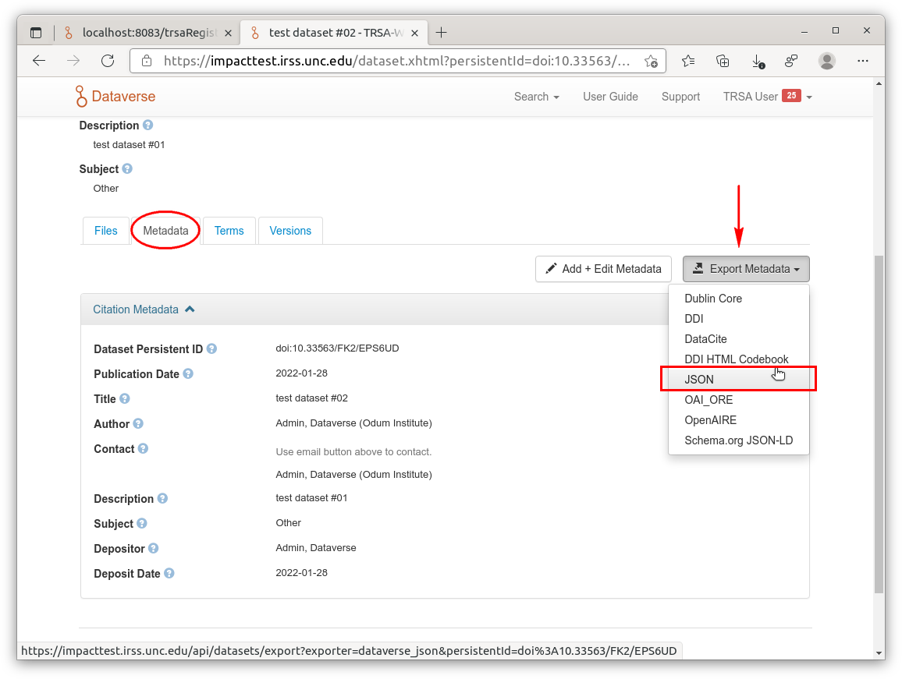

= TRSA-Web Version 3.0: Step-by-Step GUI Guide
:toc: right 
:toclevels: 3

:figure-caption: Figure 

* last updated: 2022-02-01

== Before you start 

=== Requirements 

* Dataverse

** TRSA-Web Registration
*** TRSA registration number

** Dataset
*** Dataset ID
*** Dataset DOI

* TRSA-Web
** Application URL 

* Others 
** Notary-Service Server
** Policy and Storage Servers  

== GUI Step-by-Step Guide

=== How to set up the paired Dataverse and Dataset 

==== Dataverse

When you start to run the TRSA-Web application very first time or if you have not yet set up a paired dataverse with TRSA-Web, the following warning message in orange shows up when you reach its home page.

image::sbsg_image/top-page_2022-01-24.png[TRSA's Home page]

The first thing you have to do is to let TRSA-Web save key information about the paired Dataverse with its web GUI.

. Click the "Setup the paired Dataverse" button and the following web page shows up:

image::../sbsg_image/dv-info-setup_2022-01-28.png[GUI for the paired Dataverse]

. Type key information about the paired Dataverse in each box as the following example shows: 

image::sbsg_image/after_dv_data_entered_2022-01-28.png[Data entry example]

. Click the "Confirm" button to check whether entered data are valid; if successfully confirmed, the message appears above the GUI pane and the "Next: Setup Dataset" button is enabled as shown below:

image::sbsg_image/after_dv_confirmation_2022-01-28.png[After Successful Confirmation]

If failed, the error message appears above the GUI pane and you can check a detailed message by clicking the "Show Exception messages" button.

==== Dataset 

After having clicked the "Next: Setup Dataset" button, the following web page like below appears: 

image::sbsg_image/fill_dataset_data_2022-01-28.png[Incomplete Dataset information]

As you can see the last three columns are not valid or empty.  You must enter valid data in these three columns as follows:

. Select the row you want to edit by clicking it:

image::sbsg_image/select_dataset_2022-01-28.png[Incomplete Dataset row]

. Click the "Edit" button below the table 

image::sbsg_image/fill_dataset_data_2022-01-28.png[Edit Dataset information]

After having clicked the "Edit" button, the following GUI pane pops up: 

image::sbsg_image/edit_dataset_data_gui_2022-01-28.png[GUI Pane for Dataset Information]

Update the data as follows (the figure below shows an example)

. Replace "0" in the box for "DatasetId" with a valid Dataset Id 
. Enter DOI information in the box for "Datasetdoi"
. Enter title data in the box for "Datasettitle"
. Click the Save button

image::sbsg_image/dataset_data_entered_2022-01-28.png[Dataset Information: An Example]

After data for your destination dataset are successfully saved, the table of paired Datasets appears like below:

image::sbsg_image/after_dataset_data_supplied_2022-01-28.png[Table of Paired Dataset]

To return the top menu (home page) of TRSA-Web to upload metadata, click the "TRSA Home" link at the left pane

=== How to submit the metadata of a local file to a remote Dataset

==== TRSA: top menu 
After information about the paired dataverse was saved, the two menu items are now enabled as follows:

image::sbsg_image/trsa-top-page-after-dv-setting_2022-02-01.png[TRSA-Web Top Page: After the Dataverse was set]

. Select the last option "Upload file metadata to an existing Dataset" to move next step:

image::sbsg_image/select_upload_menu_2022-01-28.png[Upload/Submission Option]

==== Destination (Dataset) selection
Before submitting the metadata of a local file, you must select its destination (Dataset) from the table of saved Datasets:

. click the "Select" button of your choice (row) and file-upload page appears next: 

image::sbsg_image/select_destination_dataset_2022-01-28.png[Table of Saved Datasets]

==== File upload/ingest

. Click the "CHOOSE" button from the file-upload pane as follows: 

image::sbsg_image/upload-ingest-page_2022-02-01.png[Upload and Ingest Page]

. Select a local file from the pop-up file-selector: 

. click the "Ingest the uploaded file" button: 

image::sbsg_image/after_file_selection_2022-01-28.png[ingest]

If the selected file was successfully uploaded, a success messages appears above the pane and "go to Submission page" button is enabled as shown below:

. click the "go to Submission page" button

image::sbsg_image/after_successful_ingest_2022-01-28.png[After the Ingest request was successful]

==== Submission 

Before submission, the current selection of the Notary Service is shown as follows: 

. Click the "save Notary Service designation" button 

image::sbsg_image/submission_page_2022-01-28.png[Submission Page]

If the above Notary-Service setting was successfully saved, the success message is displayed and the submission pane appears as shown below: 

image::sbsg_image/after_save_NS_dest_2022-01-28.png[submission pane]

. click the "Submit Metadata" button to send the metadata to the pre-selected Dataset: 

image::sbsg_image/before_submission_2022-01-28.png[before submission]

If the above submission request was successful, the success message appears on the page as follows:

image::sbsg_image/after_successful_submission_2022-01-28.png[after submission]

=== Manage Dataverse Settings 
After you have saved at least one destination Dataset with TRSA-Web, you may want to manage (modify/add/delete) a saved Dataset; you can manage the saved datasets as follows: 

. Click the "TRSA Home" Link of the left Menu Box to return to the top page
. Click the "Manage the destination datasets" button from the top menu 

Or 

. Click the "Manage Dataverse Settings of left Menu Box"

Either way, the following page appears: 

image::sbsg_image/manage-dv-settings_2022-02-02.png[Manage Dataverse Settings Link]

* To add a new Dataset, click the "+ Create" button:
* To modify an existing Dataset, select its row and click the "Edit" button 
* To delete an existing Dataset, select its row and click the "Delete" button

== Appendix A: How to register your TRSA with a Dataverse server

. Log in the Dataverse server with an Admin-level credentials [a non-Admin-level account does not show the following "dashboard" option]

. Click and open the pulldown menu:

. Click the Dashboard; the Dashboard page appears

. Click the "Manage TRSAs" button; the TRSA registry table appears: 

. Click "+ Create" Button to register your TRSA; The data entry pane pops up as follows: 

. Type data in each entry box
. Click the calendar icon for each time-entry box to set start/expire times
. Click the "Save" button 

== Appendix B: How to collect required information about a destination Dataset
=== API Token 

. Log in the Dataverse server

. Click and open the pulldown menu

. Click the API Token option

=== Dataset: Its ID and DOI information 

. Retrieve the target Dataset and show its top page as follows: 

. Click the "Metadata" tab and the value for "Dataset Persistent ID" is the required DOI information 

. Click the "Export Metadata" button and select "JSON" as shown below: 

[Depending upon your browser settings,] a downloaded JSON file is shown in a new tab as shown below.
. Find the value for the keys: "datasetI" and "datasetPersistentId" from the returned JSON object

