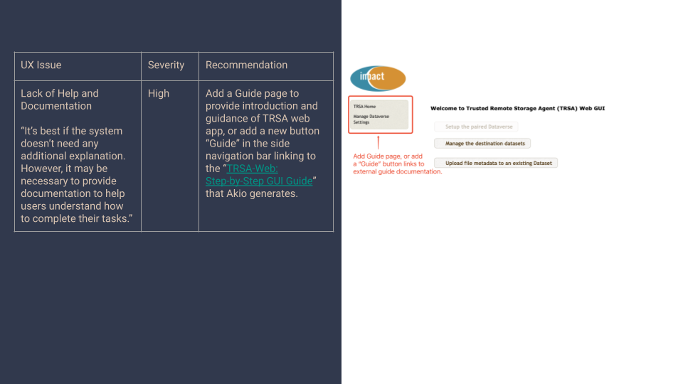
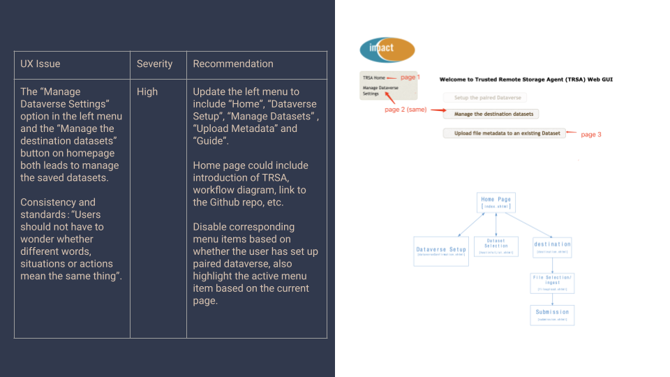
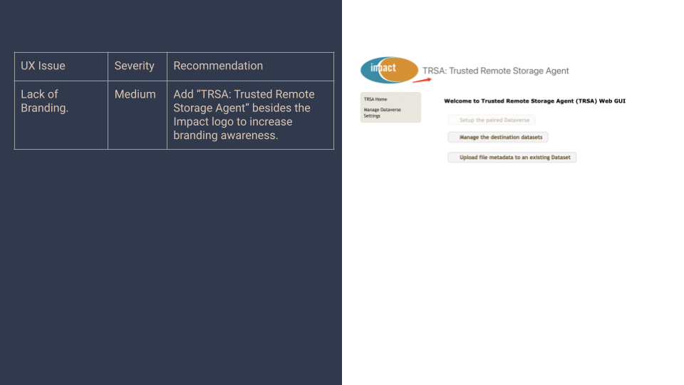
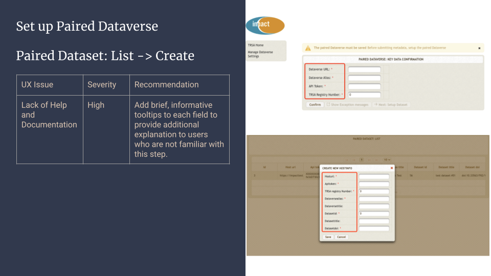
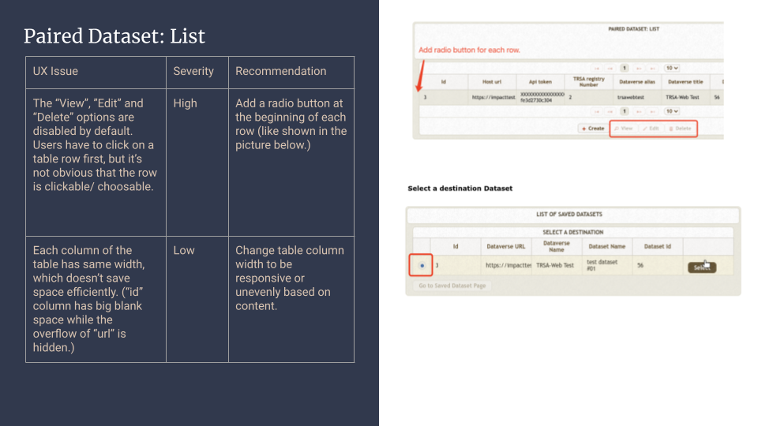
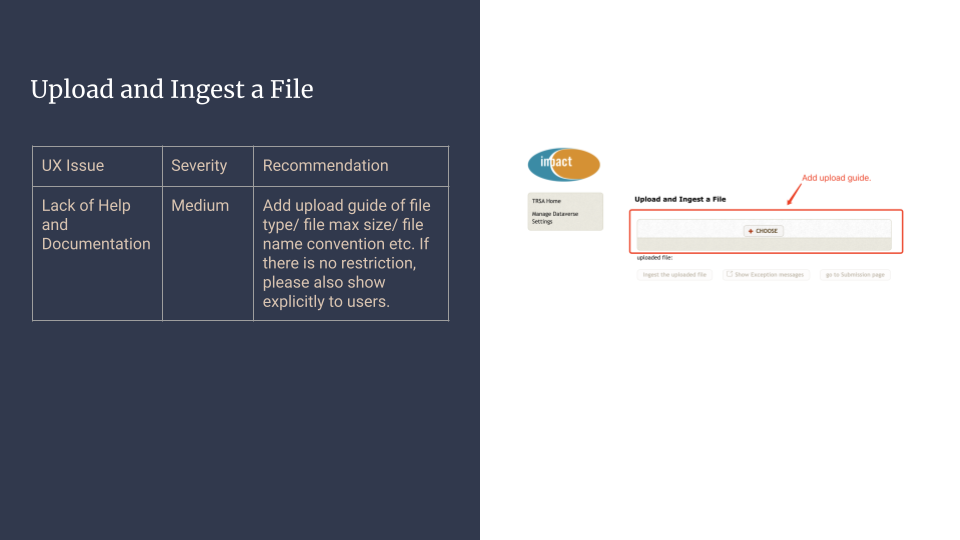
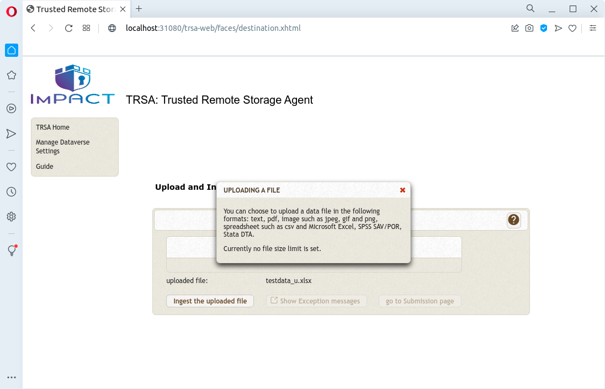
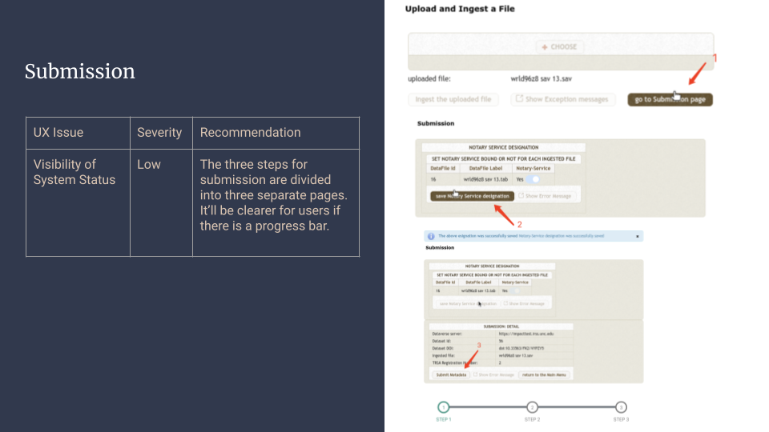
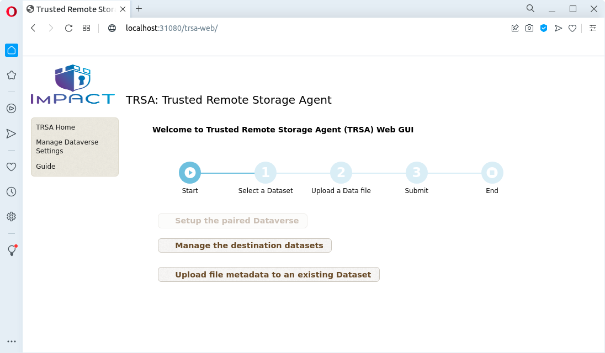
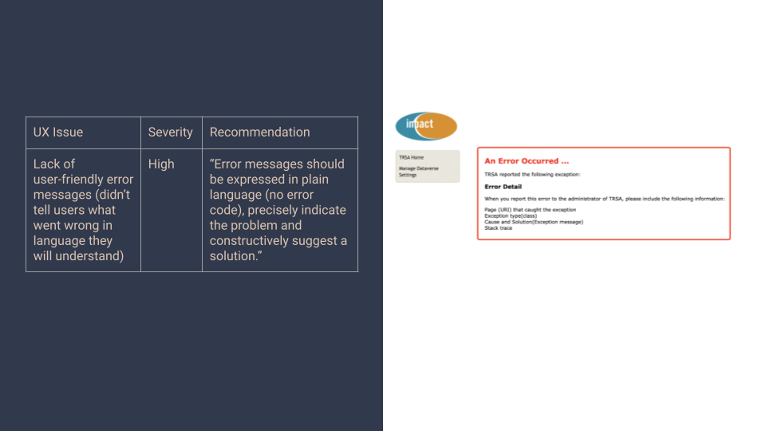

= How to implement the recommendations in the heuristic evaluation report
:toc: right
:icons: font
last update: 2022-04--22

== Implementation
=== Page 2: help/guide

.The recommendations
* To add a guide page +
or 
+
* To add a URL link to the guide document on the Github site

.Alternative fixes
* To place a URL link to the github page (guide)
* To add the GUI guide (single html file) to the war file

NOTE: Using asciidoc's cross-references (section) as a link to a given web page?

.Actual fix
* [*] To add a link to the html guide 

=== Page 3: reorganizing links on the home page

.The recommendations:
* To reorganize the current left-menu as follows:
----
Current:                      Recommended:
---------------------------------------------
TRSA Home                     Home
Manage Dataverse Settings     Dataverse Setup
                              Manage Datasets
                              Upload Metadata
                              Guide 
----
* To update the the contents of the home page, e.g., 
** introduction of TRSA
** workflow diagram
** Link to the GitHub page

.Plan
* Since the recommended reorganization involves significant backend changes and is closely related to the progress bar suggested on page 7, these recommendations will be dealt with after the other recommendations are implemented.
* The content section of the home page includes:
** Step-progress banner
** General information about TRSA: Link to the GitHub Site, important documents
** Checklist of required data

=== Page 4: Home page: Branding

.The recommendation
* To add "TRSA: Trusted Remote Storage Agent" besides the Impact logo

.Actual fixes
* [*] To implement the above recommendation
* [*] To replace the curren logo with a new one (color)

=== Page 5: dataverseConfirmation page: help and documentation

.The recommendation
* To add a tooltip to each input field 

.Plan
* To follows the tooltip/help of Dataverse's GUI coding

.Actual Fix
* [*] To follow the design of Dataverse's tooltip/help but implement them by PrimeFaces' tooltip and Google's material icon set
* [ ] To download and include material-icon-related files into the war file

=== Page 6: hostinfo/list and destination pages

.The recommendations
* (hostinfo/list page) To add a radio-button column to the table on hostinfo/list page
* (destination page) To modify column-width settings so that the cell contents are not wrapped

.Actual Fixes
* The column-width issue:
* [*] To add tableStyle="width:auto" resizableColumns="true" to p:datatable
* The radio button column:
* [*] To use PrimeFaces' `Single Selection with RadioButton` construct 

.Remaining issues
* After the above changes, `p:panel` component still does not auto-resize with contents, esp. height.
* Clicking a radio button itself does not select a row; a non-radio-button column must be clicked

=== Page 7: fileupload page: Context help

.The recommendation
* To add an upload guide to this page

.Plan
* To add a context-help component to the page
* To add a link to the relevant section of Guide to the page

.Actual Fixes
* [*] To add the ingest-specific context help (popup dialog-box)

* [ ] To add the link to the ingest section of the guide to this page

=== Page 8: fileupload/submission Pages

.The recommended solution
* To add some step indicator to these pages

.Plan 
* This issue and the menu-reorganization issue(page 3) are solved by using a step-progress banner like below:

=== Page 9: error page

.The recommendation
* To add user-friendly error messages to the error page

.Diagnosis
* The root cause of this issue, i.e., no meaningful error message, was that the exception-handling class failed to capture messages from the `ViewExpiredException` (session expiration).  For this particular case ( `ViewExpiredException`) , the best user-friendly solution would be to discard the expired session data and return to the home page with a new session rather than forwarding to the error page.

.Actual Fix
* [*] To deal with `ViewExpiredException` (session expiration) by returning the home page

